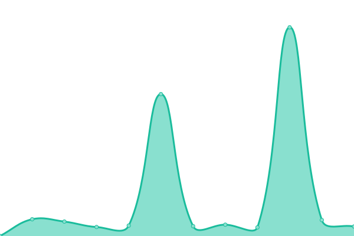

# [📈 Live Status](https://status.hootware.com): <!--live status--> **🟩 All systems operational**

This repository contains the open-source uptime monitor and status page for [Hootware Ltd](http://hootware.com), powered by [Upptime](https://github.com/upptime/upptime).

With [Upptime](https://upptime.js.org), you can get your own unlimited and free uptime monitor and status page, powered entirely by a GitHub repository. We use [Issues](https://github.com/hootware/status/issues) as incident reports, [Actions](https://github.com/hootware/status/actions) as uptime monitors, and [Pages](https://status.hootware.com) for the status page.

<!--start: status pages-->
<!-- This summary is generated by Upptime (https://github.com/upptime/upptime) -->
<!-- Do not edit this manually, your changes will be overwritten -->
<!-- prettier-ignore -->
| URL | Status | History | Response Time | Uptime |
| --- | ------ | ------- | ------------- | ------ |
|  [Hootware](https://hootware.com) | 🟩 Up | [hootware.yml](https://github.com/hootware/status/commits/HEAD/history/hootware.yml) | 

 113ms
     
 | 

<a href="https://status.hootware.com/history/hootware">100.00%</a>
    

|  [Don't Interrupt](https://dontinterrupt.app) | 🟩 Up | [don-t-interrupt.yml](https://github.com/hootware/status/commits/HEAD/history/don-t-interrupt.yml) | 

 590ms
     
 | 

<a href="https://status.hootware.com/history/don-t-interrupt">100.00%</a>
    

|  [Don't Interrupt (www)](https://www.dontinterrupt.app) | 🟩 Up | [don-t-interrupt-www.yml](https://github.com/hootware/status/commits/HEAD/history/don-t-interrupt-www.yml) | 

 2093ms
     
 | 

<a href="https://status.hootware.com/history/don-t-interrupt-www">99.64%</a>
    

<!--end: status pages-->

[**Visit our status website →**](https://status.hootware.com)

## 📄 License

- Powered by: [Upptime](https://github.com/upptime/upptime)
- Code: [MIT](./LICENSE) © [Hootware Ltd](http://hootware.com)
- Data in the `./history` directory: [Open Database License](https://opendatacommons.org/licenses/odbl/1-0/)
